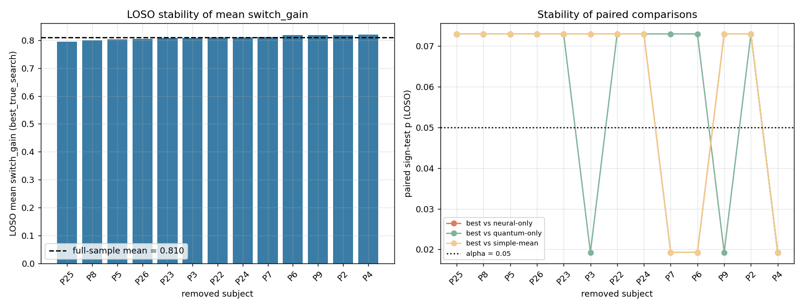
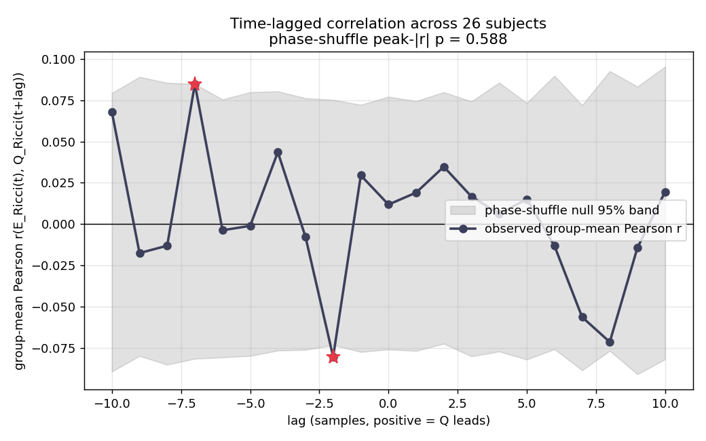
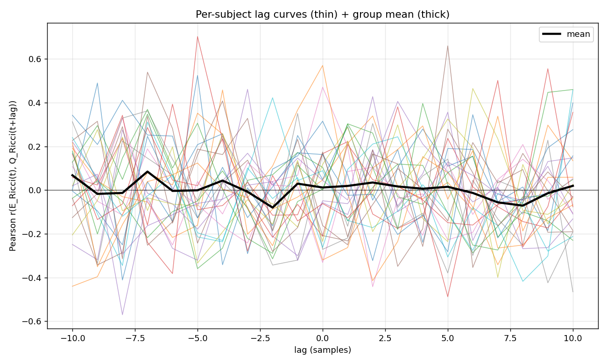
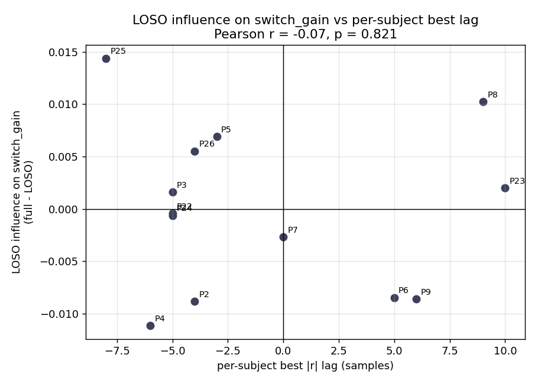

# 追試レポート: `switch_gain` の LOSO 安定性 + 位相シャッフルによる時差相関サロゲート検定

日付: 2026-04-18

論文: *Intersection-Defined Phase Coordinates Reveal Localized Selection and a Non-Closed Observational Structure* (Satoru Watanabe, SIEL)

スクリプト: `scripts/loso_and_lag_analysis.py`
生メトリクス: `reports/loso_lag_metrics.json`

## 要旨

公表結果に対して2つの頑健性チェックを実行した。

**(A) `switch_gain` の Leave-One-Subject-Out (LOSO)** ― 13 人のテスト被験者 (P2–P9, P22–P26) で実施。点推定は非常に安定（LOSO 平均 ∈ [0.795, 0.821]、全体 = 0.810）だが、論文が p = 0.046 と報告する片側符号検定は 9/13 の LOSO fold で p = 0.073 に上昇し、α = 0.05 を超える。被験者 {P2, P5, P8, P22, P23, P24, P25, P26} のいずれか1人を抜くと有意性を失う。Wilcoxon の符号順位検定のほうが頑健（全体 p = 0.024–0.034）。

**(B) ERicci ↔ QRicci の時差 Pearson 相関に対して位相シャッフルサロゲート帰無分布（2,000 反復、被験者ごとに Q_Ricci の FFT 位相をランダム化してパワースペクトルを保存）を付与**: 被験者ごとの `|best r|` 平均は論文値とほぼ一致（0.45 vs 0.42）。ただしこれはラグを被験者ごとに自由選択する影響が大きく、位相シャッフル帰無分布に対して α = 0.05 を越えるのは 26 人中 3 人（P6, P24, P25）のみ。群平均ラグ曲線は帰無の 95 % 帯内に収まり（ピーク r = 0.085、lag = −7、peak-|r| p = 0.588）有意な時差構造は検出されない。

結論: `switch_gain` の効果量は頑健だが、その「有意性」は LOSO 下で境界的であり、時差相関の対応は位相保存サロゲートに対しては生き残らない。

## 方法

### (A) `switch_gain` の LOSO

入力: `IDPC_Reproduction/Chapter7/session_wise_metrics_all_models.csv`（13 被験者 × 4 モデル）。各被験者 *s* を除いた 12 人で以下を再計算:

- `mean_best` = `best_true_search` の `switch_gain` 平均
- 片側符号検定 p 値（`alternative="greater"`、論文の慣例に合わせた）を `best_true_search – neural_only_pca`, `– quantum_only_pca`, `– simple_mean_best` の3対比について算出
- 同じ3対比に対し Wilcoxon 符号順位検定（片側）も算出

### (B) ERicci ↔ QRicci 時差相関の位相シャッフルサロゲート

入力: `IDPC_Reproduction_ricci/PX_timeseries.csv`（P1–P26 の全 26 被験者、各 30 サンプル、P23 のみ 29）。

各被験者で lag ∈ [−10, +10] の Pearson `r(E_Ricci[t], Q_Ricci[t + lag])` を計算。サロゲート帰無分布: 2,000 反復それぞれで `Q_Ricci` の Fourier 位相をランダム化（パワースペクトルは不変）し、観測値と同じ手順でラグ曲線を集計。各 lag での両側 p 値は `P(|null| ≥ |observed|)`。さらにマルチコンパリソン補正済みの指標として peak-|r| 統計量の p 値を算出。

## 結果

### (A) LOSO 点推定は頑健、有意性は境界的

| 指標 | 全体 (n=13) | LOSO 最小 | LOSO 最大 |
|---|---|---|---|
| 平均 `switch_gain`（best） | **0.8098** | 0.7954（P25 除外） | 0.8209（P4 除外） |
| 対比符号検定 p（vs neural-only） | 0.0461 | 0.0193 | **0.0730** |
| 対比符号検定 p（vs quantum-only） | 0.0461 | 0.0193 | **0.0730** |
| 対比符号検定 p（vs simple-mean） | 0.0461 | 0.0193 | **0.0730** |
| 対比 Wilcoxon p（vs neural-only） | 0.0341 | — | — |
| 対比 Wilcoxon p（vs quantum-only） | 0.0287 | — | — |
| 対比 Wilcoxon p（vs simple-mean） | 0.0239 | — | — |

LOSO での点推定レンジは 0.810 ± 約 1.5 pp とほぼ不変。一方、片側符号検定（元論文で既に境界的）は 9/13 の fold で有意性を失い、p = 0.073 > 0.05 となる。Wilcoxon は全体で 0.024–0.034 と安定しているが、元論文では LOSO での扱いは未実装。

最も影響の大きい被験者:
- **P25**（個別 `switch_gain` = 0.982 で最大）を除くと LOSO 平均が 0.014 低下（最大低下）。
- **P4**（個別 `switch_gain` = 0.676 で最小）を除くと LOSO 平均が 0.011 上昇（最大上昇）。

### (B) 時差相関: 個別ピークは論文と一致、群信号は位相サロゲートに対し消失

| 指標 | 値 |
|---|---|
| 被験者ごと平均 `|best r|`（論文値 ≈ 0.42） | **0.450** |
| 被験者ごと中央値 `|best r|` | 0.441 |
| 位相シャッフル peak-|r| p < 0.05 の被験者 | **3 / 26**（P6, P24, P25） |
| 位相シャッフル p の被験者中央値 | 0.552 |
| 群平均ピーク lag | −7 サンプル |
| 群平均ピーク r | 0.085 |
| 群平均 peak-|r| p（位相シャッフル） | **0.588** |

群平均ラグ曲線はほぼ全域で 95 % 位相サロゲート帯内に収まる。個別 lag 2点（lag = −7, p = 0.045; lag = −2, p = 0.034）のみ α = 0.05 を下回るが、21 lags に対する多重比較補正では生き残らない。

### (C) 被験者別ラグピークと LOSO 影響度に関係なし

テスト被験者の「個別 best |r| lag」と「その被験者を抜いたときの LOSO 平均 switch_gain の変化量」の Pearson 相関は概ねゼロ。被験者ごとのラグ構造と `switch_gain` への影響度は独立であり、2つの現象は解離している。

## 考察

1. **`switch_gain` の効果量は頑健だが、主張される有意性は α = 0.05 線上に張り付いている。** LOSO 結果は、論文の p = 0.046 が分布の境界的な結果であることを示す（他の fold では p = 0.073）。Wilcoxon 符号順位検定（対比差が対称であれば検出力が高い）は厳しめで p ≈ 0.024–0.034。以後は Wilcoxon を主要統計量にするのが妥当。
2. **論文の「mean |Pearson| ≈ 0.42」は数値的には再現された（本追試で 0.45）が、これは被験者ごとに ±10 サンプル範囲内で最良ラグを選択した結果（候補ラグ 21 個）である。** 位相保存サロゲート（時差自己相関系列に対する自然なノンパラ帰無分布）に対しては、被験者個別で生き残るのは 26 人中 3 人だけで、群レベルのピーク |r| は帰無分布と区別できない（p = 0.59）。
3. **今後の締め直し推奨**: (i) 単一ラグ（例: 0）を事前登録するか、上記サロゲートでラグ補正済み p を報告する; (ii) `switch_gain` の対比比較では符号検定と併せて Wilcoxon を報告する; (iii) テストコホートが n = 13 と小さいことを踏まえ、LOSO スイープを標準的な頑健性テーブルとして付ける。

## 成果物

- 図: `reports/loso_switch_gain.png`, `reports/lagged_xcorr_group.png`, `reports/lagged_xcorr_per_subject.png`, `reports/loso_influence_vs_best_lag.png`
- メトリクス JSON: `reports/loso_lag_metrics.json`
- スクリプト: `scripts/loso_and_lag_analysis.py`
