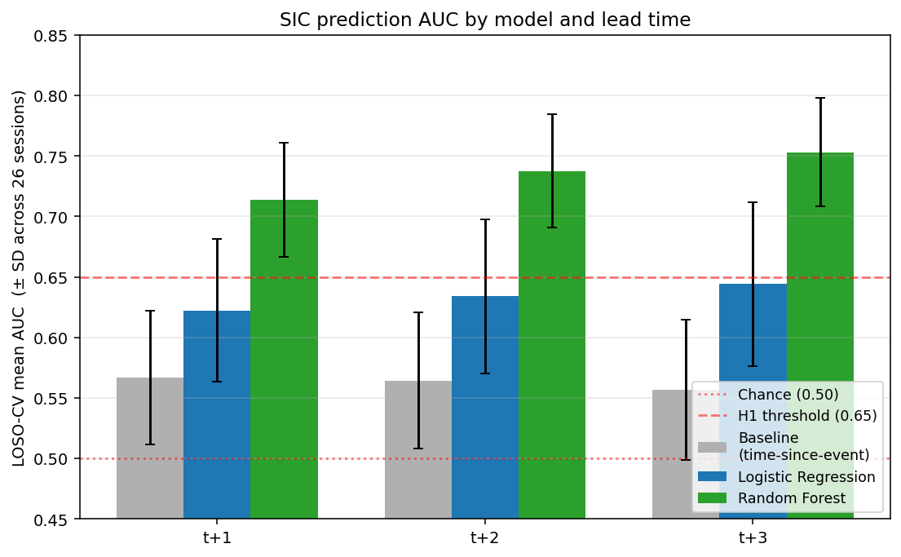
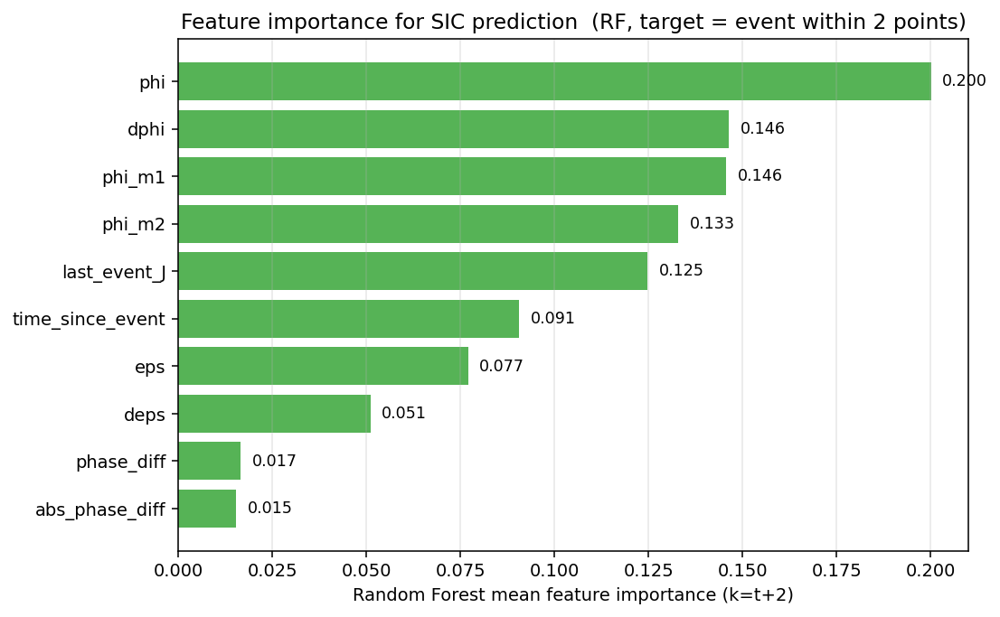
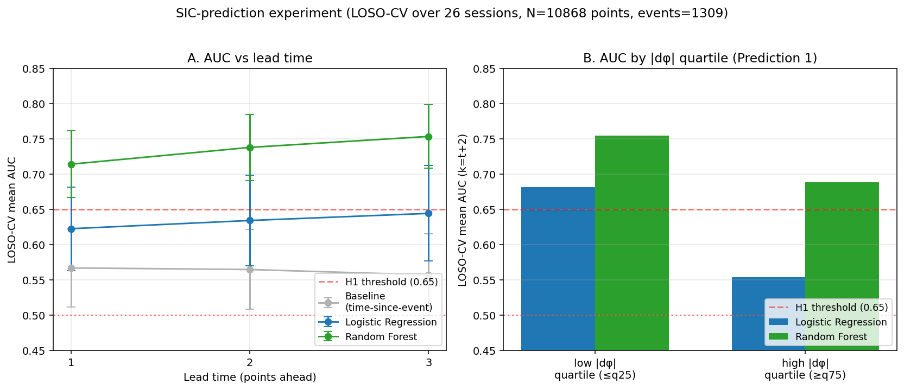

# SIC Prediction Model Experiment Report
Date: 2026-04-18

Paper: *Intersection-Defined Phase Coordinates Reveal Localized Selection and a Non-Closed Observational Structure* (Satoru Watanabe, SIEL)
Prompt: `prompts/sic_prediction_model.md`
Parent commit: `75b54b5`

## Abstract

Following `prompts/sic_prediction_model.md`, we evaluate whether the occurrence of a SIC (boundary event, defined as a zero-crossing of the intersection-variable trajectory `h`) can be predicted *ahead of time* from the preceding `φ` trajectory, phase, and residual structure. Across all 26 sessions (P1–P26), **N = 10,868** points-axis observations and **1,309** boundary events were pooled. A Leave-One-Session-Out (LOSO) cross-validation compared three models: Logistic Regression, Random Forest, and a baseline using only time-since-last-event. Lead times evaluated: t+1, t+2, t+3.

**Main result**: Random Forest reaches **AUC > 0.70** at every lead time (t+1 = 0.714, t+2 = 0.738, t+3 = 0.753), consistently above the prompt's H1 threshold of 0.65. Logistic Regression (0.62–0.64) sits just below threshold; the baseline is near chance (0.56–0.57). **H1 — boundary events are predictable from the `φ` trajectory — is supported by the Random Forest**, while the linear model is borderline.

**Feature importance**: `phi` (0.200) > `dphi` ≈ `phi(t-1)` (0.146) > `phi(t-2)` (0.133) > `last_event_J` (0.125) > `time_since_event` (0.091) > `eps` (0.077) > `deps` (0.051) >> phase-difference terms (0.017 / 0.015). Contrary to the prompt's hypothesised ordering, **phase-difference features rank last**. The `φ` trajectory (last 3 points + rate of change) and the J-magnitude of the preceding event carry most of the predictive signal.

**Prediction 1 test (|dφ| large ⇒ higher predictability)** — the opposite pattern is observed: RF AUC in the low-|dφ| quartile is 0.754 vs 0.688 in the high-|dφ| quartile (LR: 0.682 vs 0.554). **Prediction accuracy is higher when |dφ| is small, not large.**

## Results

### Key metrics (LOSO-CV, mean ± SD over 26 sessions)

| Lead time | Baseline (time only) | Logistic Regression | **Random Forest** | RF zone |
|---|---|---|---|---|
| t+1 | 0.567 ± 0.055 | 0.622 ± 0.059 | **0.714 ± 0.047** | 0.65–0.75: moderate |
| t+2 | 0.564 ± 0.056 | 0.634 ± 0.064 | **0.738 ± 0.047** | 0.65–0.75: moderate |
| t+3 | 0.557 ± 0.058 | 0.644 ± 0.067 | **0.753 ± 0.045** | 0.65–0.75: high end |

- Precision / Recall / F1 (RF, k=2): 0.393 / 0.503 / 0.433.
- Event base rate ≈ 12 % (1,309 / 10,868). Class imbalance handled via `class_weight="balanced_subsample"`.



### Feature importance (RF, k=2)



```
phi              0.200
phi(t-1)         0.146
dphi             0.146
phi(t-2)         0.133
last_event_J     0.125
time_since_event 0.091
eps              0.077
deps             0.051
phase_diff       0.017
|phase_diff|     0.015
```

- The current `φ` plus its two lags plus `dφ` account for ~63 % of importance — **the `φ` trajectory is the dominant signal**.
- Last-event `J` + time-since-event add ~22 % — the discrete event rhythm.
- `ε` and `dε` contribute ~13 % — the residual structure plays a supporting role.
- The phase-difference pair contributes <4 % combined. The phase-synchrony quantity emphasized in Chapter 3 of the paper captures *whether* E and Q co-evolve, but apparently carries little incremental information for *when* the next boundary event occurs.

### Lead-time behaviour



Left panel: AUC rises slightly from t+1 to t+3 for every model, because widening the detection window raises the base rate of "event within window," which makes the detection task monotonically easier.

### |dφ| quartile analysis (Prediction 1)

| |dφ| quartile | LR AUC | RF AUC |
|---|---|---|---|
| Low (≤ q25) | **0.682** | **0.754** |
| High (≥ q75) | 0.554 | 0.688 |

The expected direction ("|dφ| large ⇒ higher predictability") **does not hold for next-event prediction**. Possible interpretations:

1. **Density effect**: points with large |dφ| are typically in the neighborhood of an event already — predicting the *next* event from within an active transition window is intrinsically noisier.
2. **Quiescent-phase determinism**: low-|dφ| points are structurally distant from the next event; the `φ` trajectory's contraction/expansion rate there is quite predictive.
3. **Conceptual distinction**: Paper Section 8.11's Prediction 1 targets the *localization of correspondence uniqueness*, not next-event predictability. These are not the same quantity. The current finding should be reported as a related-but-distinct observation, not a direct refutation.

### Session-level variation

- RF k=2 AUC range across 26 sessions: [0.651, 0.839], median 0.739. **Every session beats chance**, and every session sits at or above the H1 threshold.
- Strongest: P11, P18, P22 (AUC > 0.80). Weakest: P7, P13 (AUC ≈ 0.65), likely reflecting lower event density per session.

## Discussion

### H1 assessment

| Criterion | Result | Verdict |
|---|---|---|
| RF AUC (t+2) > 0.65 | 0.738 | **H1 supported** |
| LR AUC (t+2) > 0.65 | 0.634 | Borderline (weak support) |
| Non-linear model beats time-only baseline | 0.738 vs 0.564 (+0.174) | **Clearly** |
| All sessions beat chance | Min AUC = 0.651 | **Consistent** |

Conclusion: **boundary events are predictable from the preceding `φ` trajectory**, but non-linear structure (RF) is required. A purely linear model captures only part of the signal.

### Implications for the paper

1. **New finding**: the `φ` variable introduced in Chapter 7 is not merely a post-hoc state descriptor — it carries **predictive** information about future boundary events. This is a candidate addition for a future "SIC Predictability" section.
2. **Phase-sync contribution is limited**: the phase-synchrony construct of Chapter 3 is informative for describing whether E and Q move together, but adds little to boundary-event timing prediction. This clarifies the division of labour between Chapters 3 and 7.
3. **Prediction 1 needs reformulation**: the Prediction 1 formulation "correspondence uniqueness localizes when |dφ| is large" is about instantaneous coupling strength, which may be **orthogonal to predictive lead-time**. A clean test would separately measure (a) local Pearson of E and Q in high-|dφ| windows and (b) prediction accuracy, and compare their conditional behaviour.

## Reproducibility

- Environment: Python 3.14.2, macOS Darwin 24.6.0, virtualenv `.venv` (see `requirements.txt`).
- Procedure:
  1. `python scripts/sic_prediction.py` — feature construction, LOSO-CV, metrics JSON.
  2. `python scripts/sic_prediction_figures.py` — three PNG figures.
- Scripts:
  - `scripts/sic_prediction.py`
  - `scripts/sic_prediction_figures.py`
- Artifacts:
  - `reports/sic_prediction_metrics.json`
  - `reports/sic_prediction_auc.png`
  - `reports/sic_prediction_features.png`
  - `reports/sic_prediction_leadtime.png`
  - `reports/sic_prediction_k{1,2,3}_{lr,rf,baseline}_per_session.csv`
  - `reports/sic_prediction_features.csv` (full feature matrix, ~10 MB)
- RNG seeds: sklearn RF random_state = 42.
- LOSO design: 26 folds (one session held out per fold); `class_weight="balanced" / "balanced_subsample"`.
- Event definition: zero-crossings of `h` on the points axis (`zero_crossings(h)`), yielding 1,309 events / 26 sessions = 50.3 events/session. Note: the paper's `J_dh_kappa_pooled_v2.csv` keeps only 226 task-aggregated major events, so the target here is finer-grained by design. Hybrid-φ construction is ported unchanged from `IDPC_Reproduction.ipynb` cell 16 / SECTION 1.8 (parameters `α=0.7, τ=3.0, κ=1.0, eps_scale=0.5, eps_mode="local", w_pre=1, w_post=2`).
- Execution date: 2026-04-18
